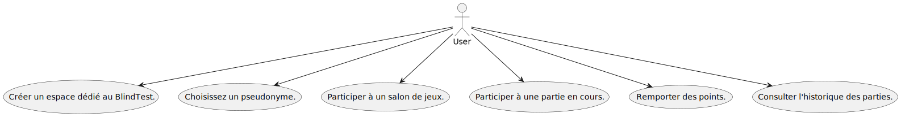

# BlindTest

> Une application qui permet de lancer une musique.

## Cas d'utilisation

L'utilisateur doit deviner le nom de la musique.
Il gagne des points.

## Stack

Libre mais architecture SPA / ApiREST.
Persitance de données SQL

## Cas d'utilisation



```uml
@startuml
:User: --> (Use#1)
:User: --> (Use#2)
:User: --> (Use#3)
:User: --> (Use#4)
:User: --> (Use#5)
:User: --> (Use#6)
"Créer un espace dédié au BlindTest." as (Use#1)
"Choisissez un pseudonyme." as (Use#2)
"Participer à un salon de jeux." as (Use#3)
"Participer à une partie en cours." as (Use#4)
"Remporter des points." as (Use#5)
"Consulter l'historique des parties."as (Use#6)
@enduml
```
